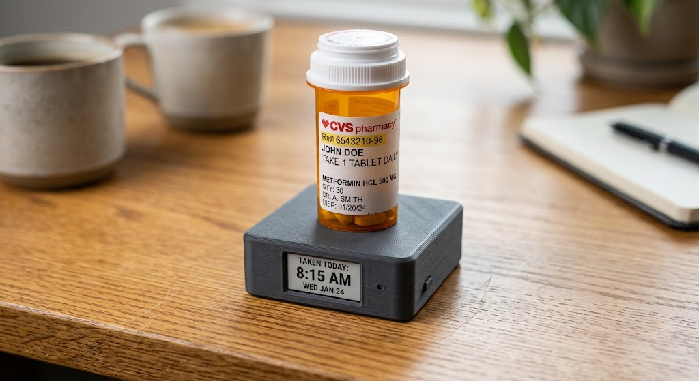

<project_context name="Project PillStand" status="Planning / Backlog" architecture="Embedded Rust (no_std)">

## 📌 PROJECT OVERVIEW & GOAL
Design and build "Project PillStand" — a 2" × 2" cordless, long-battery-life (6–12+ months) smart coaster/resting base to track pill bottle presence (e.g., Vyvanse).
* Target Microcontroller: ESP32-C3 (RISC-V architecture)
* Target Language: Rust (`no_std` bare-metal ecosystem)
* Primary Features: Zero-idle-power E-Paper display, ESP-NOW wireless broadcast, local audio double-dose warnings, Home Assistant integration via USB gateway node.

---

## 🛠️ HARDWARE ARCHITECTURE & BOM
* MCU: ESP32-C3 SuperMini (~22.5 mm × 18 mm) — low deep-sleep draw (~5–15 µA).
* Display: 1.54" SPI E-Paper Module (200x200) — zero power consumption during idle reading.
* Sensor (Option A): Micro Switch / Tactile Button (0 mA resting draw, hardware EXT0/GPIO wake interrupt).
* Sensor (Option B): 1kg Load Cell + HX711 (HX711 PD_SCK pin held high enables < 1 µA sleep mode).
* Audio: 3V Passive Piezo Buzzer (local alert on rapid replacement / double-dose warning).
* Power: 3.7V 600–1000 mAh flat LiPo cell + low-quiescent LDO regulator.
* Gateway: Standard ESP32 Dev Board (USB-powered, dedicated Home Assistant / MQTT bridge).

---

## ⚡ POWER & BATTERY CALCULATIONS
* Sleep Current: ~10 µA (ESP32-C3 deep sleep with power LED desoldered).
* Daily Wakes: 28 wakes/day (4 bottle lifts/replacements + 24 hourly display updates).
* Active Burst Current: 100 mA for 0.3 s (ESP-NOW packet blast + E-Paper refresh).
* Mathematical Model:
  - Sleep Daily Draw = 10 µA × 24 h = 0.24 mAh/day
  - Active Daily Draw = 28 wakes × (0.3 s / 3600 s) × 100 mA ≈ 0.233 mAh/day
  - Total Daily Consumption = 0.473 mAh/day
  - Theoretical Life (600 mAh LiPo): ~1,268 days (~3.4 years)
* Adjusted Real-World Range: 6 to 12+ months per charge (accounting for LiPo self-discharge ~2%/month).

---

## 🌐 WIRELESS PROTOCOL & SYSTEM TOPOLOGY
* Selected Protocol: ESP-NOW (2.4GHz connectionless vendor action frames).
* Awake Time per Transmission: 50–300 ms (instant packet blast vs 500–2000 ms pairing window for BLE).
* Topology Flow:
  [ Smart Coaster Pad (Sender) ] --(ESP-NOW 2.4GHz Packet)--> [ USB Gateway Node (Receiver) ] --(Wi-Fi / MQTT)--> [ Home Assistant Host ]

---

## 🦀 EMBEDDED RUST ARCHITECTURE (`no_std`)

### Target Toolchain
* Target Triple: `riscv32imc-unknown-none-elf`
* Flashing & Debugging Tool: `espflash` (`cargo espflash flash --monitor`)

### Key Crates (`Cargo.toml`)
```toml
[package]
name = "PillStand-sender"
version = "0.1.0"
edition = "2021"

[dependencies]
esp-backtrace = { version = "0.11", features = ["esp32c3", "panic-handler", "exception-handler", "print-uart"] }
esp-hal = { version = "0.18", features = ["esp32c3"] }
esp-wifi = { version = "0.6", features = ["esp32c3", "esp-now"] }
embedded-graphics = "0.8"
epd-waveshare = "0.6"
serde = { version = "1.0", default-features = false, features = ["derive"] }
postcard = "1.0" # Compact no_std binary serializer for ESP-NOW packet payloads

```

### Reference Implementation Baseline (`src/main.rs`)

```rust
#![no_std]
#![no_main]

use esp_backtrace as _;
use esp_hal::{
    clock::ClockControl,
    gpio::{Input, PullUp},
    peripherals::Peripherals,
    prelude::*,
    rtc_cntl::{Rtc, WakeTrig},
    system::SystemControl,
    timer::PeriodicTimer,
};
use esp_wifi::{esp_now::EspNow, initialize, EspWifiInitOutput};
use serde::{Deserialize, Serialize};

#[derive(Serialize, Deserialize, Debug)]
struct PillStandPayload {
    device_id: u8,
    item_present: bool,
    battery_mv: u16,
}

#[entry]
fn main() -> ! {
    let peripherals = Peripherals::take();
    let system = SystemControl::new(peripherals.SYSTEM);
    let clocks = ClockControl::max(system.clock_control).freeze();

    let mut rtc = Rtc::new(peripherals.LPWR);
    let timer = PeriodicTimer::new(peripherals.TIMG0);

    // Read Presence Sensor State (GPIO 4)
    let switch_pin = Input::new(peripherals.GPIO4, PullUp);
    let is_present = switch_pin.is_low(); // Switch closed = bottle present

    // Init ESP-NOW Driver Stack
    let init: EspWifiInitOutput = initialize(
        timer,
        esp_hal::rng::Rng::new(peripherals.RNG),
        peripherals.RADIO_CLK,
        &clocks,
    )
    .unwrap();

    let wifi = peripherals.WIFI;
    let mut esp_now = EspNow::new(&init, wifi).unwrap();

    // Serialize & Blast ESP-NOW Packet
    let payload = PillStandPayload {
        device_id: 0x01,
        item_present: is_present,
        battery_mv: 3700,
    };

    let mut buffer = [0u8; 32];
    if let Ok(bytes) = postcard::to_slice(&payload, &mut buffer) {
        let broadcast_mac = [0xFF, 0xFF, 0xFF, 0xFF, 0xFF, 0xFF];
        let _ = esp_now.send(&broadcast_mac, bytes);
    }

    // Enter Deep Sleep with GPIO Wake Lock on State Change
    rtc.sleep_deep(&[(&switch_pin, WakeTrig::AnyLow)]);

    loop {}
}

```

---

## 📐 ENCLOSURE & MECHANICAL DESIGN

* Dimensions: 2.0" × 2.0" × 0.8" (50.8 mm × 50.8 mm × 20 mm).
* Display Mounting: Recessed front bevel at ~30° angle for visibility while bottle rests on top.
* Floating Deck Mechanism: Spring-loaded or TPU flexure top plate actuating an internal switch under >15g load.

</project_context>

```

When you paste this back to me down the line, I'll know exactly where we left off. Is there anything specific you want added to this baseline context block before you tuck it away?

